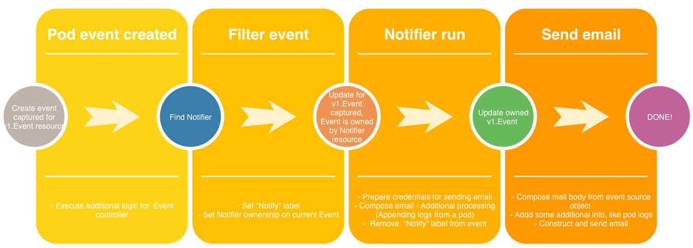

# Sample kubebuilder application - Event Notifier

Sample kubebuilder cloud-native app, which sends email notifications on pod failure (sort of).

This is done by using existing tools provided by `kubebuilder` framework, via extending existing Kubernetes [object](https://kubernetes.io/docs/concepts/#kubernetes-objects) behavior - [`v1.Event`](https://kubernetes.io/docs/reference/generated/kubernetes-api/v1.10/#event-v1-core), and creating our own Custom Resource [`(CR)`](https://kubernetes.io/docs/concepts/extend-kubernetes/api-extension/custom-resources/) - named `Notifier`

# Prerequisites

1. Kubernetes 1.17+ / Openshift 3.11+
2. Golang 1.13
3. Kubebuilder 2.0.0
4. Kustomize (optional, deploy only)

# Install

1. Deploy a cluster
- [oc cluster up](https://docs.okd.io/latest/getting_started/administrators.html#installation-methods) (openshift)
- [Minikube](https://kubernetes.io/docs/setup/learning-environment/minikube/)
2. [Install](https://golang.org/doc/install) golang
3. [Install]() kubebuilder

# Cloud-native application



## CR - `email.notify.io/v1.Notifier`

```
apiVersion: email.notify.io/v1
kind: Notifier
metadata:
  name: notifier-sample
  namespace: test
spec:
  # Add fields here
  email: test@test.com
  filters:
  - BackOff
```

# Sources
- [kubebuilder book](https://book.kubebuilder.io/)
- [Programming kubernetes](https://learning.oreilly.com/library/view/programming-kubernetes/9781492047094/)
